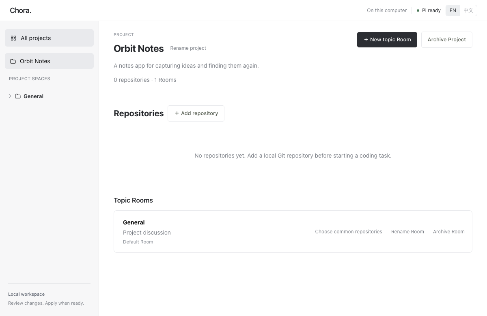
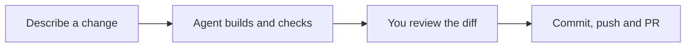
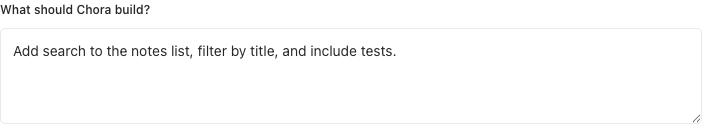

# Chora

**An open-source workspace for people and AI agents to build software together.**

**English** | [简体中文](README.zh-CN.md)

[Quick start](#quick-start) · [Your first task](#your-first-task) · [Project status](#project-status) · [FAQ](#faq)

Bring repositories and conversations into one project. Describe a change, follow
the agent's work, then review the code and decide what to ship. The long-term
vision is a self-hostable, model-neutral collaborative development workspace.

> **Today: Developer Alpha.** Run from source on Apple Silicon macOS with Pi. A desktop installer is not available yet.



*Actual Workbench UI with a fictional Orbit Notes project, shown just after creation and before adding repositories.*

## How a task works



| What you want to do | What Chora provides |
| --- | --- |
| Organize a project | Multiple repositories in one project; rooms group tasks by topic. |
| Follow the work | Visible plans, activity, and checks, with cancel and retry. |
| Decide what ships | Separate task branches and worktrees; confirm each delivery step. |
| Resume later | Saved task and review history across restarts. |

## Quick start

### 1. Get the prerequisites

**Apple Silicon Mac · Git · Node.js 22.19+ · npm 11+ · Go 1.26+**

Bring your own model access, configured in Pi. Docker is not required.
Install `gh` only if you want to create or merge GitHub PRs from Chora.

### 2. Build and start Chora

```sh
git clone https://github.com/Yangyang96/chora.git
cd chora
npm ci
npm run web:build
go run ./cmd/chora workbench --source "$(pwd -P)"
```

When the terminal prints `Chora Workbench listening on http://127.0.0.1:8787`,
open [Chora in your browser](http://127.0.0.1:8787). Keep the terminal running.
Use the language switch in the app to choose English or Chinese.

To stop Chora, press `Ctrl-C`. To start it again, run the last command from the
same directory. Your data is kept in `~/.chora/data`.

### 3. Connect Pi to your model

Pi is the coding agent that executes tasks for Chora.

1. Open the Pi installation panel. Chora can reuse a compatible `pi` on your
   `PATH`; otherwise, click **Install fixed Pi version** to install Pi 0.85.1.
2. Run the configuration command shown in the panel in another terminal. For
   an existing PATH installation, this is `pi`.
3. In Pi, use `/login` to configure your provider and `/model` to select a model.
4. Return to Chora and click **Refresh**. If the panel asks you to restart Chora,
   stop it with `Ctrl-C` and run the startup command again.

This workflow uses **Trusted Local · No Sandbox** (Local Connected). Read and
acknowledge the in-app disclosure before starting: Pi runs on your host with
access to local tools, files, credentials, and the network. Task worktrees
separate code changes; they are not a security sandbox. Model requests go to
your configured provider.

## Your first task

**1. Create a project and add a repository.** Choose a local Git repository with
at least one commit, then open its General room. Add more repositories or topic
rooms whenever you need them.

**2. Describe a small change.** Click **New task** and start with one clear request:



*Close-up of the actual task input. This example is a draft, not an executed task.*

**3. Choose the scope and start.** Confirm the repository, target branch, and
check policy; automatic checks are a good starting point. Select and acknowledge
Local Connected, then follow progress and answer any questions that need you.

**4. Review, then deliver.** Read the diff and check results. Accept the change
or ask for a fix. Accepted edits stay in the task worktree; Commit, Push, PR,
Merge, and Cleanup each require confirmation. Uncommitted changes in your
original checkout are not copied into a new task.

> **Accepting a review does not publish code.** Pi checks are labeled **Agent-reported**; unobserved checks remain **Unverified**.

<details>
<summary>Try the interface without a model</summary>

After the clone, install, and build steps above, run this instead of Workbench:

```sh
CHORA_DEMO_ROOT="$(mktemp -d /private/tmp/chora-demo.XXXXXX)"
go run ./tools/e2eserver \
  --db "$CHORA_DEMO_ROOT/chora.db" \
  --web "$PWD/web/dist" \
  --port 8787
```

Open [the local demo](http://127.0.0.1:8787). It uses scripted examples and makes
no model calls; it does not perform real AI coding. Stop any other Chora server
on port 8787 first. Press `Ctrl-C` to stop; the temporary data is not removed
automatically.

</details>

## Project status

As of **September 11, 2026**, source is public and Chora remains in Developer Alpha.

| Status | Scope |
| --- | --- |
| Implemented | Multi-repository projects, rooms and tasks, visible execution, review/recovery, and per-repository delivery. |
| Implemented | Pi setup guidance, model provenance, backup/restore, and local diagnostics. |
| Current limits | Apple Silicon macOS + Pi; Local Connected has no sandbox. No desktop installer yet. |
| Pending | Final user acceptance and a tagged release. Public source is not a stable-release claim. |
| Planned | Public sandbox setup, more providers, team and multi-agent collaboration, background and remote tasks. |

See the [roadmap](ROADMAP.md) for the longer-term direction.

## FAQ

<details>
<summary>Data, troubleshooting, and supported changes</summary>

### Does Chora change my original checkout?

New tasks work in separate Git worktrees under `~/.chora/data/task-workspaces/`.
Accepting a review leaves those changes on the task branch. Publishing is a
separate action. Existing uncommitted changes in your checkout are not copied
into a task's committed base.

### Where are my tasks stored?

Projects, tasks, and history live in `~/.chora/data`, together with managed task
worktrees. Restart with the same data directory to reopen them. You can choose
another absolute path with `--data /absolute/path/to/data`, outside the Chora
source directory. See [backup and recovery](docs/workbench-maintenance.md)
before moving, deleting, or upgrading data.

### Pi is not ready, or the browser will not open. What should I check?

Check Node's version with `node --version`, finish Pi login and model selection,
then refresh the installation panel. Follow any restart prompt. If port 8787
is occupied, add `--port 8788` to the startup command and open that port instead.
For other failures, see [troubleshooting and diagnostics](docs/workbench-maintenance.md).

### Can I use Linux, Windows, another agent, or a sandbox?

The current real-agent setup is Pi on Apple Silicon macOS. Cross-platform CI
checks do not establish support for the complete workflow on other systems.
The retained isolated Docker path requires private maintainer inputs and is
not a public setup option. More providers and deployment choices are future
work; see the [roadmap](ROADMAP.md).

### What changes are supported?

Tasks can add, edit, delete, and rename ordinary UTF-8 text files across selected
repositories. Changes to binary files, Git LFS content, submodules, and executable
modes are currently rejected. Dependencies are not installed automatically;
declare any setup commands your task needs. Multi-repository delivery proceeds
one repository at a time, without an atomic cross-repository merge.

</details>

## Documentation and contributing

- [Documentation](docs/README.md) — guides and technical references.
- [Roadmap](ROADMAP.md) — current scope and future work.
- [Contributing](CONTRIBUTING.md) — development setup and required checks.
- [Support](SUPPORT.md) — help and bug reports.
- [Security](SECURITY.md) — report vulnerabilities privately.
- [Code of conduct](CODE_OF_CONDUCT.md) — community expectations.

Chora is licensed under the [GNU Affero General Public License v3.0](LICENSE).

---

**English** | [简体中文](README.zh-CN.md)
