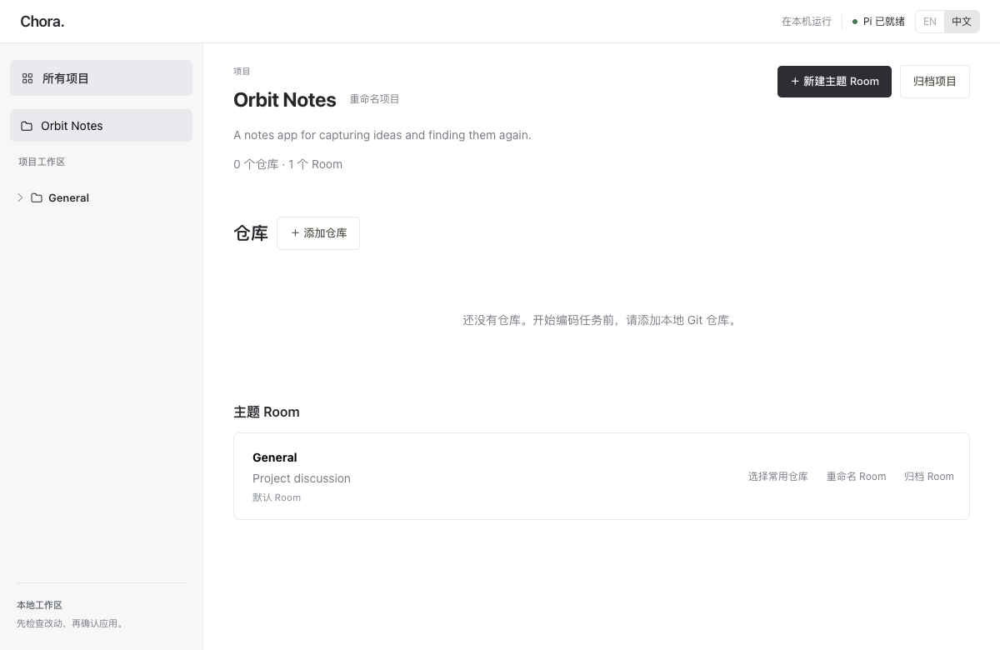

# Chora

**让人与 AI Agent 一起开发软件的开源协作工作空间。**

[English](README.md) | **简体中文**

[快速开始](#快速开始) · [第一个任务](#第一个任务) · [项目进度](#项目进度) · [常见问题](#常见问题)

把仓库和话题放进同一个项目，描述需求，查看 Agent 的执行过程，审阅代码后再决定交付。
长期方向是可私有部署、不绑定特定模型的完整协作工作空间。

> **目前：开发者 Alpha。** 通过源码运行，支持 Apple Silicon macOS 和 Pi；暂未提供桌面安装包。



*实际 Workbench 界面，使用虚构的 Orbit Notes 项目。这里展示刚创建、尚未添加仓库的状态。*

## 一次任务如何完成


| 你要做的事 | Chora 提供什么 |
| --- | --- |
| 组织项目 | 一个项目关联多个仓库，Room 按话题组织任务。 |
| 了解进度 | 展示计划、执行过程和检查结果，支持取消与重试。 |
| 决定交付 | 独立任务分支与工作树，审阅后逐步确认提交和推送。 |
| 接着工作 | 保存任务和审阅历史，重启后继续。 |

## 快速开始

### 1. 准备环境

**Apple Silicon Mac · Git · Node.js 22.19+ · npm 11+ · Go 1.26+**

还需要在 Pi 中配置你自己的模型服务商凭据或订阅。Local Connected 不需要 Docker；
只有在 Chora 中创建或合并 GitHub PR 时才需要 `gh`。

### 2. 构建并启动 Chora

```sh
git clone https://github.com/Yangyang96/chora.git
cd chora
npm ci
npm run web:build
go run ./cmd/chora workbench --source "$(pwd -P)"
```

终端出现 `Chora Workbench listening on http://127.0.0.1:8787` 后，
在浏览器中[打开 Chora](http://127.0.0.1:8787)，并保持终端运行。
可以通过应用内的语言切换按钮选择中文或英文。

按 `Ctrl-C` 停止服务。再次使用时，在同一目录运行上面最后一条命令即可。
数据保存在 `~/.chora/data`。

### 3. 为 Pi 配置模型

Pi 是为 Chora 执行编程任务的 Agent。

1. 打开 Pi 安装面板。Chora 可以复用 `PATH` 中已有的兼容 `pi`；如果没有，
   点击 **安装固定 Pi 版本**，安装 Pi 0.85.1。
2. 在另一个终端中运行面板显示的配置命令。如果复用的是 PATH 中的 Pi，命令就是 `pi`。
3. 在 Pi 中使用 `/login` 配置服务商，再用 `/model` 选择模型。
4. 回到 Chora 点击 **刷新**。如果面板提示需要重启，按 `Ctrl-C` 停止 Chora，
   再运行启动命令。

这条路径使用 **可信本地 · 无沙箱**（Local Connected）模式。开始前请阅读并确认应用内说明：
Pi 直接在本机运行，可以访问本地工具、文件、凭据和网络。任务工作树用来分开代码改动，
不提供安全沙箱隔离。模型请求会发送到你配置的服务商。

### 4. 选择执行模式

**本地隔离**使用公开构建的固定 Pi/Docker 环境，首个支持范围为 Node.js 标准库项目。
新建任务时点击准备环境，准备完成后重启 Workbench；不可用时不会回退到主机。
支持平台、Codex 登录、资源与网络策略见[本地隔离指南](docs/isolated-local.zh-CN.md)。
也可以明确选择并确认 **可信本地 · 无沙箱**，使用上面配置的本机 Pi。

## 第一个任务

**1. 创建项目，添加仓库。** 用文件夹选择器选中一个已有提交的本地 Git 仓库，
打开默认的 General 话题空间（Room）。之后可以继续添加仓库或新建话题。

**2. 用一句话描述改动。** 点击“新建任务”，从一个小改动开始：


*真实任务输入框特写。示例只填写了需求，尚未执行。*

**3. 选择范围，开始执行。** 确认仓库、目标分支和检查策略；可以保留自动检查。
选择已准备的本地隔离模式，或明确确认本地连接模式后开始，观察计划与进度，必要时回答 Agent 的问题。

**4. 审阅，再交付。** 查看差异和检查结果，接受改动或要求修复。
接受后代码留在任务工作树中；提交、推送、PR、合并和清理分别确认。
原始仓库中未提交的改动不会复制进新任务。

> **接受审阅不会自动发布。** Pi 报告的检查标注为“Agent 报告”，未观察到的检查保持“未验证”。

<details>
<summary>不配置模型，先体验界面</summary>

完成前面的克隆、依赖安装和构建后，用下面的命令替代 Workbench 启动命令：

```sh
CHORA_DEMO_ROOT="$(mktemp -d /private/tmp/chora-demo.XXXXXX)"
go run ./tools/e2eserver \
  --db "$CHORA_DEMO_ROOT/chora.db" \
  --web "$PWD/web/dist" \
  --port 8787
```

在浏览器中[打开本地演示](http://127.0.0.1:8787)。演示使用预设脚本，不调用模型，
也不会执行真实 AI 编程。启动前请先停止占用 8787 端口的其他 Chora 服务。
按 `Ctrl-C` 停止；临时数据不会自动删除。

</details>

## 项目进度

截至 **2026 年 9 月 11 日**，源码已公开，仍处于开发者 Alpha。

| 状态 | 范围 |
| --- | --- |
| 已实现 | 多仓库项目、话题与任务、可见执行、审阅与恢复、逐仓库交付。 |
| 已实现 | Pi 配置引导、模型来源展示、备份恢复和本地诊断。 |
| 当前限制 | Apple Silicon macOS + Pi，本地连接模式无沙箱；尚无桌面安装包。 |
| 尚待完成 | 最终用户验收与带 Tag 的版本发布。源码公开不等于稳定版发布。 |
| 后续计划 | 公开沙箱、更多 Provider、团队和多 Agent 协作、后台及远程任务。 |

长期规划见[路线图](ROADMAP.zh-CN.md)。

## 常见问题

<details>
<summary>数据、故障排查与支持范围</summary>

### 会修改我原来的仓库目录吗？

新任务在 `~/.chora/data/task-workspaces/` 下的独立 Git 工作树中执行。
接受审阅后，改动留在任务分支上；发布是单独的操作。
原始仓库中尚未提交的改动不会复制进任务使用的已提交基线。

### 任务数据存在哪里？

项目、任务和历史记录保存在 `~/.chora/data`，受管理的任务工作树也在其中。
重启时使用同一数据目录，就可以重新打开之前的工作。
可通过 `--data /absolute/path/to/data` 指定其他绝对路径，但必须放在 Chora 源码目录之外。
移动、删除或升级数据前，请阅读[备份与恢复说明](docs/workbench-maintenance.zh-CN.md)。

### Pi 未就绪，或者页面打不开，应该检查什么？

用 `node --version` 检查 Node 版本，完成 Pi 登录和模型选择，再刷新安装面板；
如果有重启提示，请按提示操作。如果 8787 端口已被占用，在启动命令后添加 `--port 8788`，
并在浏览器打开对应端口。其他问题参见[故障排查与诊断](docs/workbench-maintenance.zh-CN.md)。

### 支持 Linux、Windows、其他 Agent 或沙箱吗？

目前真实 Agent 上手路径是 Apple Silicon macOS 上的 Pi。
跨平台 CI 通过不代表其他系统上的完整工作流程已获支持。
保留的 Docker 隔离路径需要维护者私有输入，不是公开安装选项。
其他服务商和部署方式见[路线图](ROADMAP.zh-CN.md)。

### 目前支持哪些代码改动？

任务可以跨所选仓库新增、修改、删除和重命名普通 UTF-8 文本文件。
目前会拒绝二进制文件、Git LFS 内容、子模块和可执行权限的变更。
依赖不会自动安装；任务需要环境准备时，请明确声明相关命令。
多仓库交付逐仓库进行，不支持跨仓库原子合并。

</details>

## 文档与参与贡献

- [文档](docs/README.zh-CN.md)：使用指南与技术参考。
- [路线图](ROADMAP.zh-CN.md)：当前范围与后续计划。
- [贡献指南](CONTRIBUTING.zh-CN.md)：开发环境与必需检查。
- [支持说明](SUPPORT.zh-CN.md)：获取帮助与反馈问题。
- [安全策略](SECURITY.zh-CN.md)：私密报告安全漏洞。
- [行为准则](CODE_OF_CONDUCT.zh-CN.md)：社区约定。

Chora 使用 [GNU Affero General Public License v3.0](LICENSE) 许可证。

---

[English](README.md) | **简体中文**
